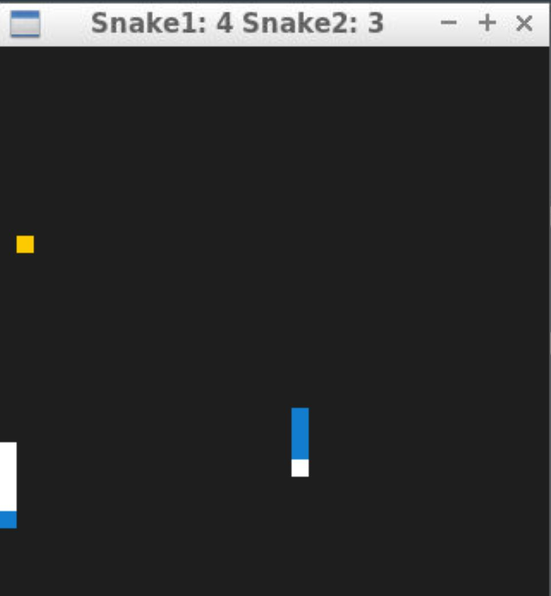
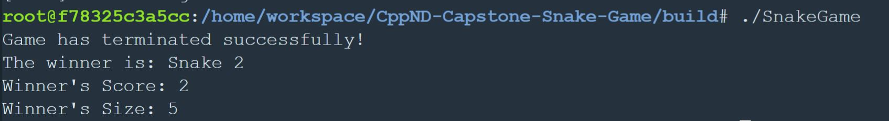
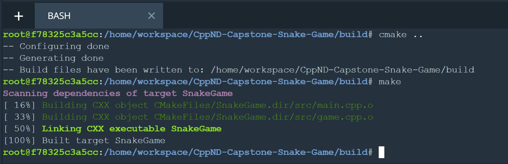

# Capstone Snake Game

## Dependencies for Running Locally
* cmake >= 3.7
  * All OSes: [click here for installation instructions](https://cmake.org/install/)
* make >= 4.1 (Linux, Mac), 3.81 (Windows)
  * Linux: make is installed by default on most Linux distros
  * Mac: [install Xcode command line tools to get make](https://developer.apple.com/xcode/features/)
  * Windows: [Click here for installation instructions](http://gnuwin32.sourceforge.net/packages/make.htm)
* SDL2 >= 2.0
  * All installation instructions can be found [here](https://wiki.libsdl.org/Installation)
  * Note that for Linux, an `apt` or `apt-get` installation is preferred to building from source.
* gcc/g++ >= 5.4
  * Linux: gcc / g++ is installed by default on most Linux distros
  * Mac: same deal as make - [install Xcode command line tools](https://developer.apple.com/xcode/features/)
  * Windows: recommend using [MinGW](http://www.mingw.org/)


## Game Overview and Rules of Play

This project is implemented in C++ and is based on the starter code provided by [Udacity at this location](https://github.com/udacity/CppND-Capstone-Snake-Game). 


As an addition to the classic snake game that is played by one player challenging himself, I implemented the snake game that can be played by two competitors. 

The first player uses the arrow keys to navigate the snake on the grid. The second player uses `w` for going up, `s` for down, `a` for left, `d` for right.

The score is displayed while playing.



The player's snake that doesn't die at the end of the game is the winner, regardless of the length of the snake.




The file and class structure is very similar to the one provided in the starter code. New functionnality was added to allow the second player.

## Rubric Points

* The submission must compile and run
The project can be build using `cmake ..` and `make` from the `build` directory. To launch the application use `./Snake Game`.



* The project demonstrates an understanding of C++ functions and control structures.

The project is organized in functions and uses control structures, like for example:

```
void Snake::UpdateBody(SDL_Point &current_head_cell, SDL_Point &prev_head_cell, std::shared_ptr<Snake> competitor) {
  // Add previous head location to vector
  body.push_back(prev_head_cell);

  if (!growing) {
    // Remove the tail from the vector.
    body.erase(body.begin());
  } else {
    growing = false;
    size++;
  }

  // Check if the snake has died by crashing into self
  for (auto const &item : body) {
    if (current_head_cell.x == item.x && current_head_cell.y == item.y) {
      alive = false;
      score = -1;
      break;
    }
  }
  // Check if the snake has died by crashing into competitor
  if (current_head_cell.x == static_cast<int>(competitor->head_x) && current_head_cell.y == static_cast<int>(competitor->head_y)) {
      alive = false;
      score = -1;
    }
  else{
    for (auto const &item : competitor->body) {
      if (current_head_cell.x == item.x && current_head_cell.y == item.y) {
        alive = false;
        score = -1;
        break;
      }
    }
  }

}
```

* The project accepts user input and processes the input.
For the implementation of the second player controls, new keys are processed from the keyboard:

```
case SDLK_w:
	ChangeDirection(snake2, Snake::Direction::kUp,
              Snake::Direction::kDown);
	break;

case SDLK_s:
	ChangeDirection(snake2, Snake::Direction::kDown,
              Snake::Direction::kUp);
	break;

case SDLK_a:
	ChangeDirection(snake2, Snake::Direction::kLeft,
              Snake::Direction::kRight);
	break;

case SDLK_d:
	ChangeDirection(snake2, Snake::Direction::kRight,
              Snake::Direction::kLeft);
	break;
```

* The project uses Object Oriented Programming techniques.

The project is implemented using classes: Game, Controller, Snake, Renderer


* Classes use appropriate access specifiers for class members.

`public` and `private` access specifiers are used, like for example:

```
class Game {
 public:
  Game(std::size_t grid_width, std::size_t grid_height);
  void Run(Controller const &controller, Renderer &renderer,
           std::size_t target_frame_duration);
  int GetScore() const;
  int GetSize() const;
  int GetWinner() const;

 private:
  std::shared_ptr<Snake> snake1;
  std::shared_ptr<Snake> snake2;
```

* Class constructors utilize member initialization lists.

When members are initialized with values, initialization lists are used. This is done in conjunction with function body initialization when necessary.

```
Game::Game(std::size_t grid_width, std::size_t grid_height)
    : engine(dev()),
      random_w(0, static_cast<int>(grid_width)),
      random_h(0, static_cast<int>(grid_height)) {
        
  snake1 = std::make_shared<Snake>(1, grid_width, grid_height, 0, 0);
  snake2 = std::make_shared<Snake>(2, grid_width, grid_height, (grid_width-1), (grid_height-1));
  PlaceFood();
}
```

* Classes abstract implementation details from their interfaces.

Yes, classes implementation follow the abstractisation concepts. All function names are self explanatory.

* Classes encapsulate behavior.

Member data that is subject to an invariant is hidden from the user. State is accessed via member functions.
```
  std::cout << "Game has terminated successfully!\n";
  std::cout << "The winner is: Snake "<<game.GetWinner() << "\n";
  std::cout << "Winner's Score: " << game.GetScore() << "\n";
  std::cout << "Winner's Size: " << game.GetSize() << "\n";
```

* The project makes use of references in function declarations.

At least two variables are defined as references, or two functions use pass-by-reference in the project code.

```
 void UpdateBody(SDL_Point &current_cell, SDL_Point &prev_cell, std::shared_ptr<Snake> competitor);
 void Controller::HandleInput(bool &running, std::shared_ptr<Snake> snake1, std::shared_ptr<Snake> snake2) const;
 ```

 * The project uses smart pointers instead of raw pointers.

 The project uses at least one smart pointer: unique_ptr, shared_ptr, or weak_ptr. The project does not use raw pointers.

 In the `Game` class I have used shared pointers for the usage of the two snakes in the game.

 ```
 std::shared_ptr<Snake> snake1;
 std::shared_ptr<Snake> snake2;
 ```

 All functions using snake objects as inputs are using a copy of the respective shared pointer.

 ```
 void Render(std::shared_ptr<Snake> snake1, std::shared_ptr<Snake> snake2, SDL_Point const &food);
 void UpdateWindowTitle(std::shared_ptr<Snake> snake1, std::shared_ptr<Snake> snake2, int fps);
  ```